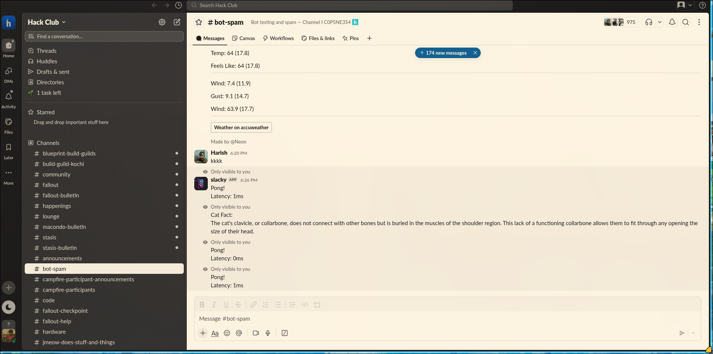

# Slacky - Slack Bot 

A simple, production-ready Slack bot built with Node.js and `neo/ping`. It's configured to run continuously as a systemd background service on Linux.

---

## 📌 What it does look like




---

## 🛠️ commant

* **neo/ping**
* **/neo-catfact**
* **/neo-help**

---

## 🚀 Setup & installation

### 1. Prerequisites
* Node.js & npm installed
* A Slack workspace with permission to add custom apps

### 2. Get your Slack Tokens
1. Go to [Slack API Dashboard](https://api.slack.com/apps) and create an app.
2. Enable **Socket Mode** and copy the App Token (`xapp-...`).
3. Under **OAuth & Permissions**, add required Bot Scopes (`chat:write`, `app_mentions:read`, etc.).
4. Install the app to your workspace and copy the Bot Token (`xoxb-...`).

### 3. Local Setup

```bash
# Clone the repository
git clone https://github.com/Gopuabhayan/slack_bot.git
cd slack_bot

# Install dependencies
npm install
